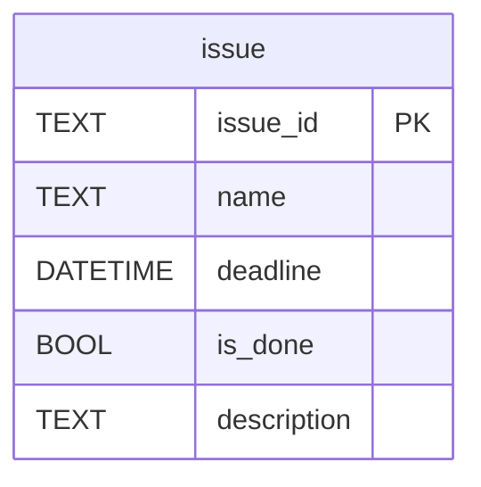

# issue-tracker App

Hier entsteht eine Issue Tracker App zum Verwalten von Aufgaben.

```mermaid
erDiagram

issue {
  TEXT issue_id PK
  TEXT name
  DATETIME deadline
  BOOL is_done
  TEXT description
}
```
